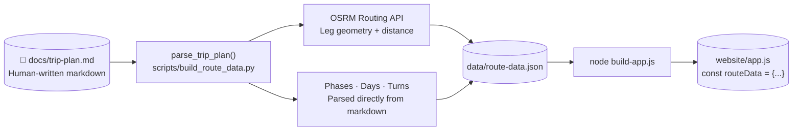

# data/

This directory holds the **source of truth** for all route data and pipeline inputs/outputs.

| File | Tracked | Description |
|---|---|---|
| `route-data.json` | ✅ Git | Compiled route data — injected into `website/app.js` by `build-app.js` |
| `photo-gps.csv` | ❌ Local | EXIF GPS extract from photo album (generated by `exiftool`) |
| `photo-stops.json` | ❌ Local | Per-stop photo lists (generated by `pipeline/1-match-photos.js`) |
| `unmatched.json` | ❌ Local | Photos with no GPS or outside 3-mile radius |
| `route-data-photos.json` | ❌ Local | Intermediate — `route-data.json` patched with photos (review before promoting) |
| `s3-manifest.txt` | ❌ Local | S3 object listing (required by `pipeline/5-cleanup-s3.js`) |
| `unmatched-review.html` | ❌ Local | Generated thumbnail viewer (from `node scripts/review-unmatched.js`) |

---

## How route-data.json is built



### Two ways to update route-data.json

| Scenario | Command |
|---|---|
| **New stops / legs** (needs fresh OSRM geometry) | `python scripts/build_route_data.py` |
| **Edit notes, days, phases, pins** (no routing needed) | Edit `data/route-data.json` directly, then `node build-app.js` |

---

## Markdown → route-data.json parsing

`scripts/build_route_data.py` reads `docs/trip-plan.md` and parses five `##` sections:

### `## Waypoints` → `legs[]` + `stops[]`

A markdown table where **order defines leg sequence** — consecutive rows become driving legs:

```markdown
| Name                        | Lon      | Lat     | Phase |
|-----------------------------|----------|---------|-------|
| Reykjavík                   | -21.9426 | 64.1466 | 1     |
| Borgarnes                   | -21.9225 | 64.5383 | 1     |
```

> ⚠️ Coordinates are **lon, lat** (GeoJSON order) — opposite of Google Maps display.

Each consecutive pair becomes one leg. OSRM fetches the road geometry, distance, and drive time. Duplicate name+phase combinations are deduplicated into `stops[]`.

### `## Route Overrides` → forced waypoints in `legs[]`

Forces a leg through an intermediate city when the shortest road path would be wrong:

```markdown
### (Krafla / Víti area) → (Selfoss via Reykjavík)
- Krafla / Víti area | -16.7792 | 65.7175
- Reykjavík          | -21.9426 | 64.1466
- Selfoss via Reykjavík | -20.9971 | 63.9334
```

Header format: `### (from_name) → (to_name)` — names must match exactly to a `## Waypoints` row.

### `## Phases` → `phases[]`

```markdown
### 1 | Wild West — Complete | May 3-5 | Borgarnes | #0c6fa8
Summary text here.

- **Item title**: Item description
```

Header: `### id | name | dates | base | color`. Leg indices are computed automatically from the waypoints order — no need to list them.

### `## Days` → `days[]`

```markdown
### May 3 | 1 | Arrive Reykjavík → Borgarnes
**Drive**: 76 km · 1h14
Drive to Borgarnes base, check in, evening walk and reset.
```

Header: `### date | phase_number | title`. `**Drive**:` line sets the drive summary; remaining lines become the plan.

### `## Route Notes` → `turns[]`

```markdown
### 3 | Phase 3 — Route 1 South via Reykjavík
Krafla area → Reykjavík → Selfoss. South Coast as add-ons.
```

Header: `### phase_number | title`. Body text becomes the note shown in the Notes tab.

---

## route-data.json schema summary

```jsonc
{
  "phases":  [ { "id", "name", "dates", "base", "color", "legs": [1,2,…], "summary", "items": [{title, desc}] } ],
  "legs":    [ { "from", "to", "phase", "distance_km", "time_min", "geometry": [[lon,lat],…], "steps": […] } ],
  "stops":   [ { "name", "lat", "lon", "type", "phase", "note", "photos": [{url, taken}] } ],
  "turns":   [ { "phase", "title", "text" } ],
  "days":    [ { "date", "phase", "title", "drive", "plan" } ],
  "totals":  { "distance_km", "time_min", "total_distance_km", "total_time_min", "total_time_formatted" },
  "updated": "…"
}
```

> `photos[]` on each stop is populated by the photo pipeline (`pipeline/2-upload-photos.js`, `pipeline/3-rematch-all.js`) — not by `build_route_data.py`. Always run the pipeline after route changes if photos need redistribution.

See `docs/route-data-schema.md` for full field-level documentation.
