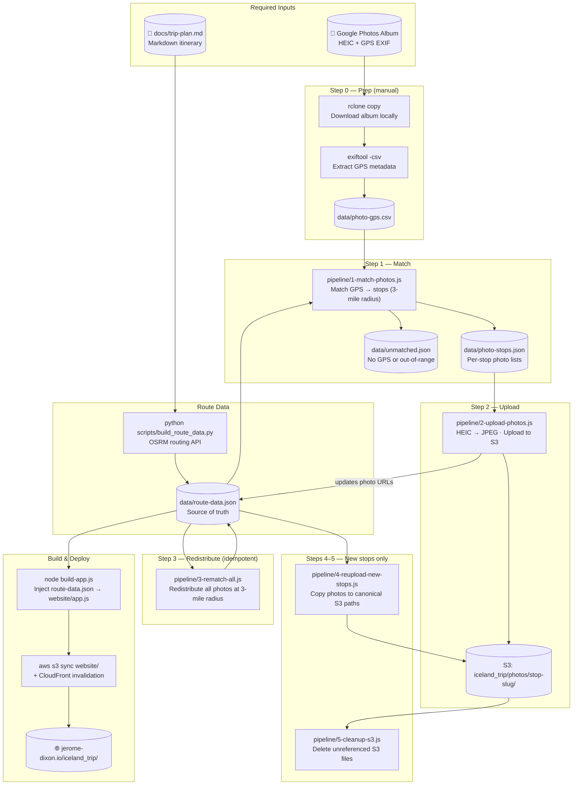

# Photos Pipeline

Transforms a **Google Photos album** into GPS-matched, S3-hosted photos embedded in the trip map.

---

## End-to-End Flow



---

## Scripts

| Script | Step | Purpose |
|---|---|---|
| *(rclone + exiftool)* | **0** | Download album, extract GPS → `data/photo-gps.csv` |
| `1-match-photos.js` | **1** | Match GPS to stops within 3-mile radius |
| `2-upload-photos.js` | **2** | Convert HEIC → JPEG, upload to S3, patch `route-data.json` with URLs |
| `3-rematch-all.js` | **3** | Re-run full match at 3-mile radius — **idempotent, safe to re-run** |
| `4-reupload-new-stops.js` | **4** | Copy photos to canonical S3 slug paths after adding new stops |
| `5-cleanup-s3.js` | **5** | Delete S3 files no longer referenced in `route-data.json` |
| `find-unmatched-clusters.js` | Diagnostic | Cluster out-of-range photos — identify candidate new stops |
| `upload-worker.js` | Internal | Worker thread used by `2-upload-photos.js` for parallel HEIC conversion |

### Shared utilities
`utils/geo-utils.js` — `haversine`, `slug`, `toDec`, `CF`, `photoUrl` — imported by all scripts.

---

## Common Workflows

### First-time setup (new photos)
```powershell
# Step 0 — download + extract GPS
rclone copy "google-photos:Iceland Trip" "photos/Iceland Trip"
exiftool -csv -FileName -GPSLatitude -GPSLongitude -GPSLatitudeRef -GPSLongitudeRef -DateTimeOriginal "photos/Iceland Trip" > data/photo-gps.csv

# Steps 1–2 — match and upload
node pipeline/1-match-photos.js
node pipeline/2-upload-photos.js

# Build and deploy
node build-app.js
aws s3 cp website/app.js s3://jerome-dixon.io/iceland_trip/app.js
aws s3 cp data/route-data.json s3://jerome-dixon.io/iceland_trip/route-data.json
aws cloudfront create-invalidation --distribution-id E3MZK5HYTJ14P3 --paths "/iceland_trip/*"
```

### After adding a new stop
```powershell
node pipeline/3-rematch-all.js          # redistribute photos
node pipeline/4-reupload-new-stops.js   # canonical S3 paths
aws s3 ls s3://jerome-dixon.io/iceland_trip/photos/ --recursive > data/s3-manifest.txt
node pipeline/5-cleanup-s3.js --dry-run # preview deletions
node pipeline/5-cleanup-s3.js           # delete stale files
node build-app.js
```

### Review unmatched photos
```powershell
node scripts/review-unmatched.js        # opens data/unmatched-review.html in browser
```

---

## Notes

- **3-mile radius** (`RADIUS_KM = 3 * 1.60934`) — nearest-stop-wins within range; photos outside are written to `data/unmatched.json`.
- **`3-rematch-all.js` is idempotent** — safe to re-run after any stop pin change.
- **Always generate `data/s3-manifest.txt` before running `5-cleanup-s3.js`** — the script reads it to know what exists on S3.
- **Photo URLs** follow the pattern: `https://jerome-dixon.io/iceland_trip/photos/{stop-slug}/{filename}.jpg`
- **Stop slugs** use `name.toLowerCase().replace(/[^a-z0-9]+/g, '-')` — Icelandic chars become `-`.
